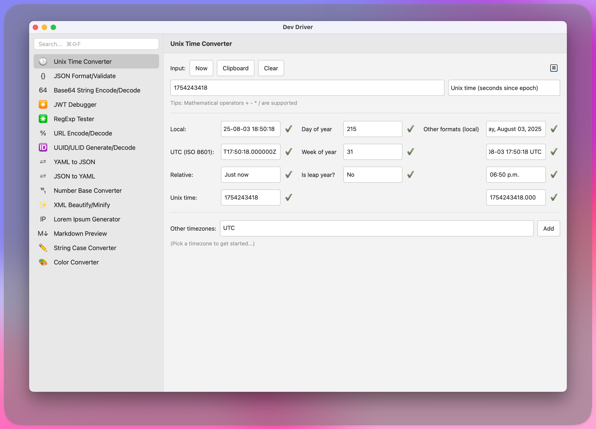

# Dev Boost

Tools to boost developer productivity and improve workflows



## Features

- **Unix Time Converter**: Convert between Unix timestamps, epoch times, and human-readable dates.
- **JSON Formatter/Validator**: Validate JSON, format with configurable indentation (2/4 spaces or tabs), minify, and query using JSONPath. Supports Unicode and complex nested structures.
- **Base64 String Encoder/Decoder**: Encode and decode text to/from Base64, with support for input/output via text fields and clipboard integration.
- **JWT Debugger**: Decode and verify JSON Web Tokens (JWTs), providing detailed inspection of token components.
- **RegExp Tester**: Test and match regular expressions against input strings, with pattern validation and result highlighting.
- **URL Encoder/Decoder**: Encode/decode URLs with options for standard or component encoding, safe characters, and plus-for-space handling. Includes clipboard support and sample inputs.
- **UUID/ULID Generator/Decoder**: Generate UUID v1, UUID v4, and ULIDs, and decode them to extract details like version, variant, and timestamp. Ensures uniqueness and lexicographical ordering.
- **XML Beautifier**: Format and pretty-print XML documents for improved readability.
- **YAML to JSON Converter**: Transform YAML data into JSON format, supporting seamless data conversion.
- **String Case Converter**: Convert text between various case formats, including upper, lower, camel, and snake case.
- **Color Converter**: Parse and convert colors between formats like HEX (3/4/6/8-digit), RGB/A, HSL/A, HSB/HSV, HWB, and CMYK. Generates code presets for CSS, Swift, Java, and other languages.
- **Lorem Ipsum Generator**: Generate placeholder text (Lorem Ipsum) for design and testing purposes.
- **Markdown Viewer**: Render and preview Markdown content in a clean, formatted view.
- **Image Optimizer**: Compress and optimize images with quality control, format conversion, and resizing options. Supports JPEG, PNG, and WEBP formats.
- **HTTP Client**: Make HTTP requests with support for all common methods (GET, POST, PUT, DELETE, etc.). Features intelligent header autocomplete, request/response body handling, response timing, and tabbed response view with headers, body, and statistics.
- **Uvx Runner**: Install and run uvx tools with a GUI interface. Features dropdown selection of predefined tools (pgcli, req2toml, restview, yt-dlp, videogrep), dynamic help display, argument input, real-time output capture, and integration with scratch pad for output management.

## Installation

DevBoost requires Python 3.11+ and PyQt6.

### Prerequisites

- uv

### Steps

1. Clone the repository:

   ```
   git clone https://github.com/namuan/devboost.git
   cd devboost
   ```

2. Install dependencies:

   ```
   make install
   ```

3. Run the application:

   ```
   make run
   ```

4. Install as an application (macOS only)
   ```
   make install-macosx
   ```

## License

This project is licensed under the MIT License. See the [LICENSE](LICENSE) file for details.
